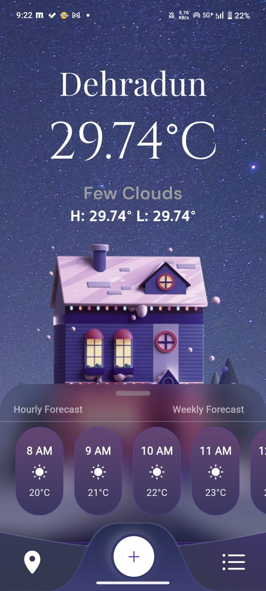
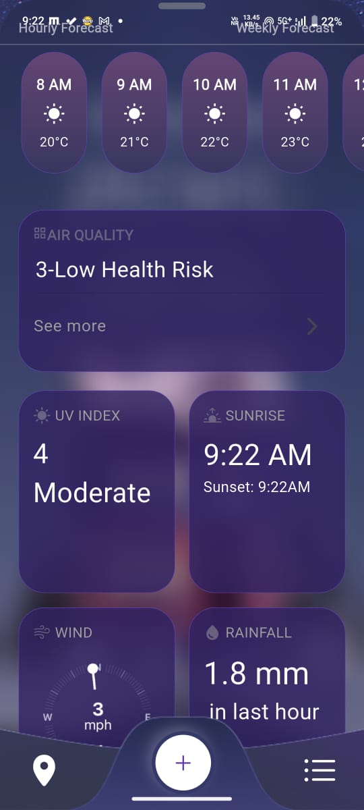
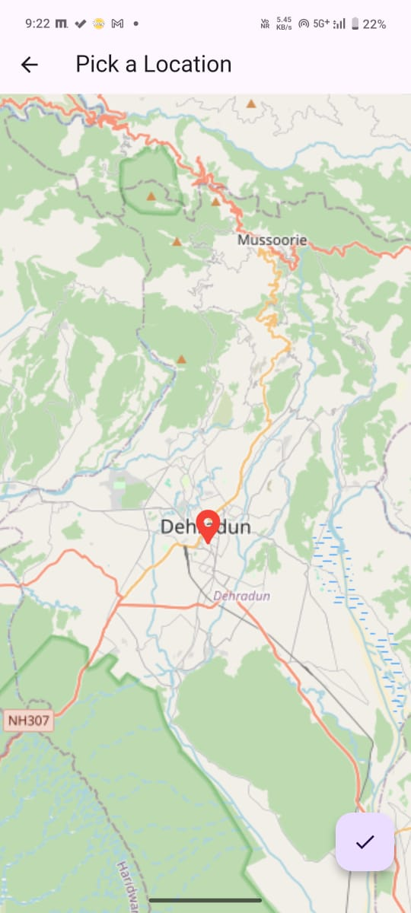

# AeroCast

🌤️ AeroCast – Your Smart Weather Companion
AeroCast is a beautifully designed weather app built using Flutter, offering real-time weather updates with intuitive map integration for a truly interactive experience. Whether you're planning your day or tracking weather patterns globally, AeroCast helps you stay informed with:

📍 Live Location-Based Forecasts

🗺️ Interactive Weather Maps (with temperature, wind, humidity overlays)

🌦️ Hourly & Weekly Forecasts

🌍 Multi-City Support

💡 Clean UI with Smooth Animations

⚠️ Severe Weather Alerts

Powered by modern Flutter UI components and seamless map APIs, AeroCast is designed for clarity, speed, and precision—making it your go-to weather assistant on the go.

<h1>Outputs</h1>

